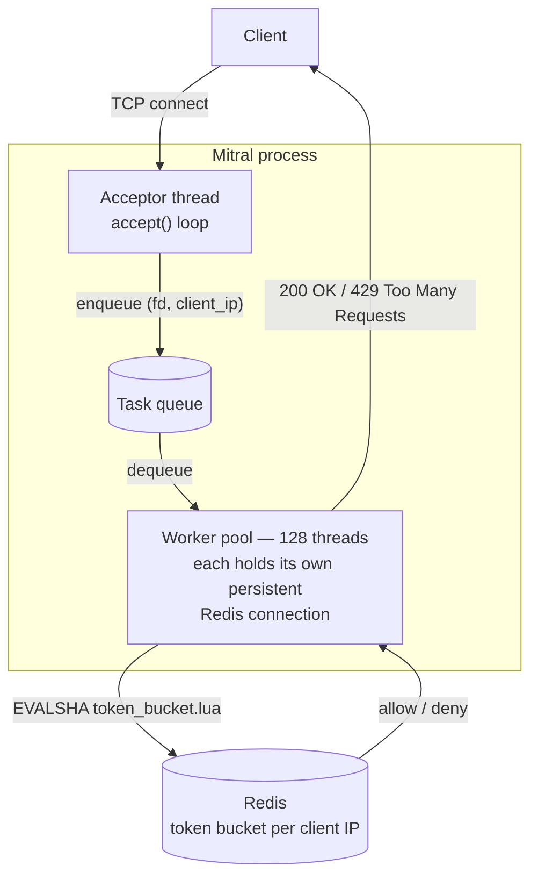
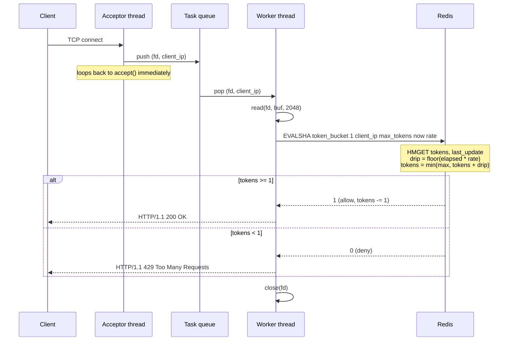

# Mitral

### Distributed API Rate Limiter Service


Mitral is a standalone rate-limiting microservice written in C++17. It speaks raw
HTTP over POSIX TCP sockets, enforces a per-client **Token Bucket** limit whose
state lives in Redis, and serves it through a fixed pool of persistent worker
threads. Each thread has a dedicated Redis connection to sustain 10,000+
requests per second without per-request connection setup or lock contention.

**Stack:** C++17 · POSIX sockets (TCP/HTTP) · Redis (Lua scripting via hiredis) · Docker · AWS

## Table of Contents

- [Architecture](#architecture)
- [Request lifecycle](#request-lifecycle)
- [Rate limiting: Token Bucket over Fixed Window](#rate-limiting-token-bucket-over-fixed-window)
- [Object lifetime & shutdown](#object-lifetime--shutdown)
- [Configuration](#configuration)
- [Build & run](#build--run)
- [API](#api)
- [Testing](#testing)
- [Design notes & known limitations](#design-notes--known-limitations)

---

## Architecture



- A single **acceptor thread** does nothing but `accept()` and hand the
  connection off. It never touches Redis and never blocks on request work.
- Accepted connections are pushed onto a shared **task queue** guarded by a
  mutex/condition variable.
- **128 persistent worker threads** pull from that queue. Each worker opens
  *one* `hiredis` connection when it starts and reuses it for the life of the
  process. Reducing overhead with per-request `connect()`, and no shared connection to lock
  around, since no two threads ever touch the same `redisContext`.
- The actual limit check is a single **Redis Lua script**, loaded once at
  boot (`SCRIPT LOAD`) and invoked per-request via `EVALSHA`, so the
  read-modify-write on a client's token count is atomic even under 128-way
  concurrency.

## Request lifecycle



## Rate limiting: Token Bucket over Fixed Window

The limiter tracks a Redis hash per client IP (`tokens`, `last_update`) and
refills it by elapsed wall-clock time on every check, rather than resetting a
counter at fixed clock boundaries:

| Parameter | Value | Where |
|---|---|---|
| Bucket capacity (`max_tokens`) | 5 | `Server::worker_thread()` |
| Refill rate | 1 token/sec | `RateLimiter::REFILL_RATE` |
| Idle bucket TTL | 10s (`EXPIRE`) | Lua script |

Fixed Window resets a counter at each window boundary, which lets a client
burst up to double its quota across a boundary (or gets a hard wall right
after a reset) and jumps discontinuously. Token Bucket drips tokens back in
continuously based on `now - last_update`, so recovery is smooth and a client
can never get more than `max_tokens` in flight. This allows a full
burst of 5 immediately, which a naive leaky-bucket-per-fixed-tick would not.
The whole drip-and-decrement happens inside one Lua script on the Redis
server, so it's atomic without any client-side locking.

## Object lifetime & shutdown

The service is split into two small, single-responsibility classes: `Server`
owns the listening socket, task queue, and thread pool, whereas `RateLimiter` owns one
Redis connection and the token-bucket check itself. Each worker thread
constructs and owns exactly one `RateLimiter`.

Both are non-copyable RAII wrappers around OS resources. `Server`'s copy
constructor and copy-assignment operator are explicitly `delete`d (same for
`RateLimiter`), since copying either would risk two owners closing the same
socket fd or freeing the same `redisContext`.

Shutdown is destructor-driven, and it drains in-progress work rather than
dropping it. The destructor only flips a flag and notifies, and the decision to
finish queued work before exiting lives in each worker's loop:

```cpp
Server::~Server() {
    { 
      std::unique_lock<std::mutex> lock(queue_mutex_); 
      stop_pool_ = true;
    }

    condition_.notify_all();

    for (auto& w : workers_) {
        if (w.joinable()) {
            w.join();
        }
    }

    if (server_fd_ >= 0) {
        close(server_fd_);
    }
}
```

```cpp
void Server::worker_thread() {
    RateLimiter local_limiter(redis_host_, redis_port_, 5, lua_sha_cache_);

    while (true) {
        std::unique_lock<std::mutex> lock(queue_mutex_);
        condition_.wait(lock, [this]() {
            return !task_queue_.empty() || stop_pool_;
        });

        if (stop_pool_ && task_queue_.empty()) {
            return;                               // nothing left to drain, safe to exit
        }
        // ...pop a connection off task_queue_ and service it
    }
}
```

- `notify_all()` wakes every worker blocked on the condition variable. Woken
  workers exit once
  `stop_pool_` is true *and* the queue is empty. Connections still queued
  when shutdown starts get popped and serviced first, instead of being
  dropped mid-shutdown.
- `stop_pool_ = true` write requires holding `queue_mutex_` to keep the write and worker's read in sync, preventing race conditions
- `lock` inside its own `{ }` block so `lock` goes out
  of scope, releasing `queue_mutex_` before `notify_all()` runs. Calling `notify_all()` while still holding the
  mutex would wake workers up to have them immediately re-block trying
  to reacquire a lock that hasn't been released.
- Each worker's `RateLimiter` is a stack-local object inside
  `worker_thread()`, so its Redis connection is closed automatically by its
  own destructor the instant the thread function returns. No separate
  cleanup path to maintain.
- `~Server()` joins every worker before closing the listening socket, so the
  destructor (and the process) doesn't return until all in-flight requests
  have actually finished.

## Configuration

All configuration is via environment variables, read once at startup:

| Variable | Default | Description |
|---|---|---|
| `PORT` | `8080` | Port Mitral listens on |
| `REDIS_HOST` | `127.0.0.1` | Redis host |
| `REDIS_PORT` | `6379` | Redis port |

The worker pool size (128) is currently a compile-time constant
(`Server::THREAD_POOL_SIZE` in `include/server.h`), not environment-driven
like the Redis settings above. Changing it requires editing the constant and
rebuilding.

## Build & run

**Locally (requires `g++`, `make`, `libhiredis-dev`, and a Redis instance):**

```bash
make
REDIS_HOST=127.0.0.1 REDIS_PORT=6379 PORT=8080 ./mitral
```

**Docker (multi-stage build, Ubuntu 24.04):**

```bash
docker build -t mitral .
docker run -p 8080:8080 --env REDIS_HOST=<redis-host> mitral
```

**Docker Compose (recommended — brings up Redis alongside Mitral):**

```bash
docker compose up --build
```

## API

Mitral doesn't route by path or method. Every TCP request on the listening
port draws down one token from that client IP's bucket:

- `200 OK`: token available, request allowed.
- `429 Too Many Requests`: bucket empty, request denied.

## Testing

`tests/test_rate_limiter.sh` is an end-to-end integration test that boots the
real binary against a live Redis and drives it through the algorithm's edge
cases:

1. **Burst capacity**: 5 back-to-back requests all succeed (the full bucket).
2. **Strict limit enforcement**: the 6th immediate request is rejected.
3. **Fractional drip recovery**: after sleeping, exactly the number of
   tokens implied by measured elapsed time (not a fixed guess) become
   available again.
4. **Token math check**: once those recovered tokens are spent, the next
   request is rejected again, proving no extra tokens leaked in.

CI (`.github/workflows/ci.yml`) runs on every push/PR to `main`: it starts a
Redis container, builds with `make`, and runs this script against the real
binary.

## Design notes & known limitations

- Rate limiting is per-client-IP and global across the whole service. No per-route or per-API-key bucketing.
- The task queue is unbounded. No backpressure if the worker pool
  ever falls behind the accept rate.
- HTTP handling is intentionally minimal: the server reads raw bytes and
  writes a hand-built status line. Doesn't parse method, path, or
  headers.
- The worker pool size is a compile-time constant rather than
  runtime-configurable (see [Configuration](#configuration)).
- Assumes a single Redis instance, no cluster/sentinel handling.

## AWS Deployment
coming soon...
